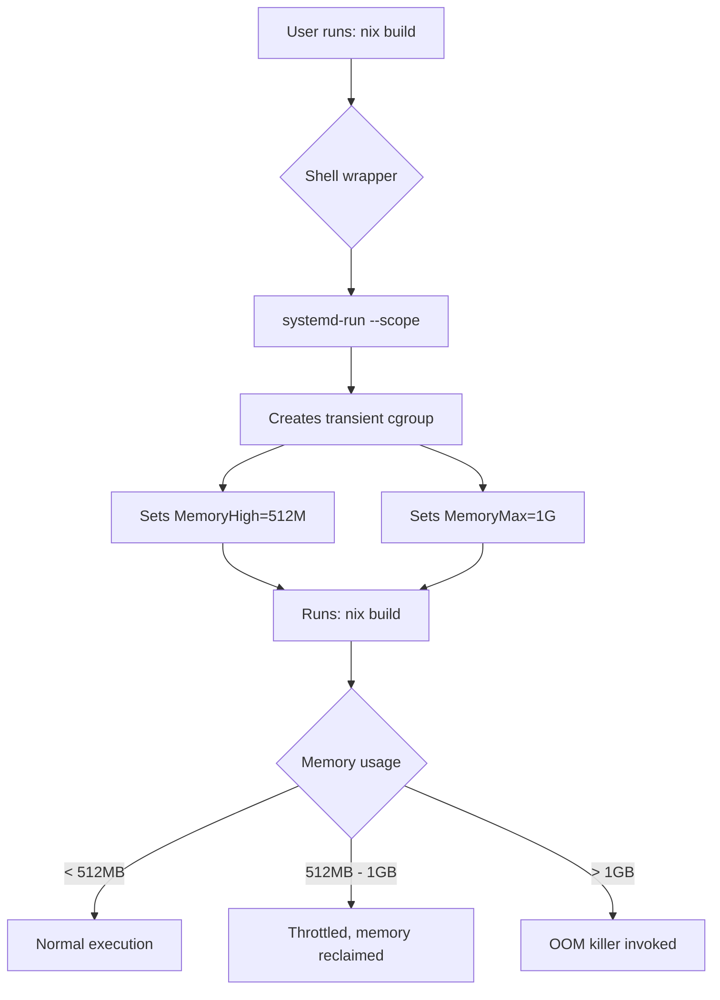

# Resource Limiting for Nix and Home-Manager Commands

## Overview

This configuration automatically wraps resource-intensive commands (nix, home-manager) with `systemd-run` to prevent excessive RAM/CPU consumption and avoid OOMD (Out-Of-Memory Daemon) killing processes.

## Implementation

### Components

1. **Shell wrappers** (`~/.bashrc.d/90-resource-limits.sh`)
   - Bash function wrappers for `nix` and `home-manager` commands
   - Automatically invokes `systemd-run` with resource limits
   - Managed via chezmoi

2. **Resource limits** (cgroups v2 via systemd)
   - **Soft limit (MemoryHigh)**: 512MB
     - Processes are throttled when this limit is approached
     - Memory is aggressively reclaimed
     - Prevents hitting the hard limit in most cases
   - **Hard limit (MemoryMax)**: 1GB
     - OOM killer is invoked if this limit is exceeded
     - Last line of defense

3. **Optional: CPU limits**
   - Can be enabled by uncommenting `CPU_QUOTA` in the config
   - Example: `CPU_QUOTA="100%"` limits to 100% of one CPU core

## How It Works



## Usage

### Normal Usage

Commands work exactly as before - the resource limiting is transparent:

```bash
# These are automatically resource-limited
nix build .#mypackage
home-manager switch
```

### Monitoring Resource Usage

```bash
# Show current configuration and running processes
show-resource-limits

# Watch resource usage in real-time
systemd-cgtop

# Check memory usage of a specific transient scope
systemctl --user status run-*.scope
```

### Custom Resource Limits for One-Off Commands

```bash
# Run a command with custom limits
run-limited 256M 512M -- some-heavy-command arg1 arg2

# With CPU quota
run-limited 512M 1G 50% -- cpu-intensive-task
```

### Bypassing Resource Limits

If you need to run a command without resource limits (e.g., for a very large build):

```bash
# Use 'command' builtin to bypass the wrapper
command nix build .#large-package

# Or temporarily unset the function
unset -f nix
nix build .#large-package
# Then reload your shell or re-source bashrc
```

## Configuration

Edit `~/.bashrc.d/90-resource-limits.sh` to adjust limits:

```bash
# Soft limit (throttling starts here)
readonly MEMORY_HIGH="512M"

# Hard limit (OOM killer at this point)
readonly MEMORY_MAX="1G"

# Optional: CPU limit (uncomment to enable)
# readonly CPU_QUOTA="100%"
```

After editing, apply changes:

```bash
# If managed by chezmoi
cd ~/.MyHome/MySpaces/my-modular-workspace
chezmoi apply

# Reload shell configuration
source ~/.bashrc
```

## Troubleshooting

### Commands fail with "Out of memory"

If legitimate large builds are failing:

1. **Temporary solution**: Bypass the wrapper (see above)
2. **Permanent solution**: Increase the limits in the config

### Slow performance during builds

This is expected when memory usage exceeds `MemoryHigh` (512MB). The kernel is throttling the process to reclaim memory.

Options:
1. Increase `MEMORY_HIGH` to give more headroom
2. Close other applications to free up system memory
3. Add more swap space

### systemd-run not found

The resource limiting only works if `systemd-run` is available. On systems without systemd, the wrappers gracefully fall back to running commands normally.

## Advanced: Using a Systemd Slice (Optional)

For more complex setups or to group multiple processes, you can create a dedicated systemd slice:

1. Create slice file:

```bash
cat <<EOF | sudo tee /etc/systemd/system/nix-builds.slice
[Slice]
Description=Resource limits for Nix builds
MemoryHigh=512M
MemoryMax=1G
CPUQuota=100%
EOF

sudo systemctl daemon-reload
```

2. Modify the wrapper to use the slice:

```bash
# In 90-resource-limits.sh, add to systemd_args:
systemd_args+=(--slice=nix-builds.slice)
```

Benefits of using a slice:
- Limits apply to all processes in the slice combined
- Persists across reboots
- Easier to manage with `systemctl`

## Verification

Check that wrappers are active:

```bash
# Should show the wrapper function, not the binary
type nix
# Output: nix is a function

# Should show the wrapper function
type home-manager
# Output: home-manager is a function

# Test resource limiting
nix --version  # Should run without systemd-run (fast command)
nix-shell -p hello --run hello  # Should use systemd-run
```

## References

- [systemd resource control documentation](https://www.freedesktop.org/software/systemd/man/latest/systemd.resource-control.html)
- [cgroups v2 kernel documentation](https://docs.kernel.org/admin-guide/cgroup-v2.html)
- [systemd-run man page](https://www.freedesktop.org/software/systemd/man/latest/systemd-run.html)
- [NixOS Discourse: Avoiding OOM during builds](https://discourse.nixos.org/t/general-question-how-to-avoid-running-out-of-memory-or-freezing-when-building-nix-derivations/55351)

## Related ADRs

- ADR-005: Chezmoi Migration Criteria
- ADR-008: Automated Jobs via Home-Manager
